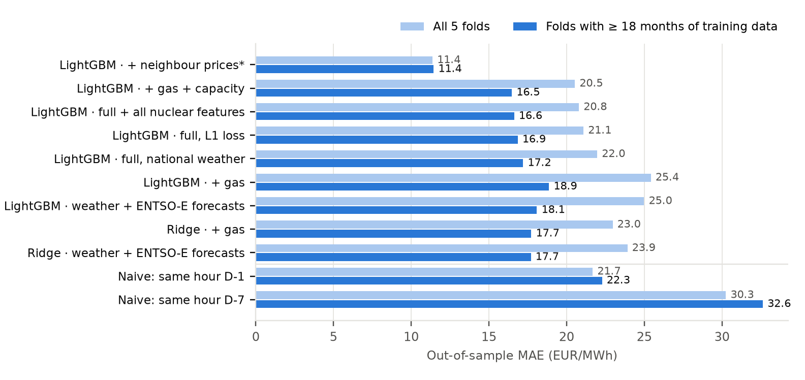

# EnergeticPricing: forecasting French day-ahead power prices

Machine-learning model that forecasts the 24 hourly prices of the French day-ahead auction (EPEX Spot FR) for day D+1, using **only information available before gate closure (D-1, 12:00 CET)**.

📄 **[Project report (PDF, 3 pages)](reports/EnergeticPricing_report.pdf)**: data, methodology, results, limitations.

## Results

Rolling-origin backtest, Jan 2023 – May 2026, 5 expanding folds, hourly MAE in EUR/MWh:

| Model | MAE, all folds | MAE, folds with ≥ 18 months of training |
|---|---|---|
| Naive: same hour D-1 | 21.7 | 22.3 |
| Ridge, weather + ENTSO-E forecasts + gas | 23.0 | 17.7 |
| **LightGBM, + installed capacity (main model)** | **20.5** | **16.5 (−26% vs naive)** |
| LightGBM + neighbour prices *(leaky upper bound)* | 11.4 | 11.4 |



Key takeaways:

- **The model beats persistence by 26%** once it has seen a full seasonal cycle. With less than about a year of history it does not beat persistence.
- **Capacity-weighted renewable potential** is the most valuable feature block. It is built from the national installation registry × local weather in each of the 96 départements.
- **Neighbour day-ahead prices are look-ahead leakage.** They clear simultaneously with France (EUPHEMIA coupling). Including them inflates R² from 0.50 to 0.79, so they are excluded from the forecasting models.
- **What did not help:** 2-day-lagged gas, an L1 loss, and **nuclear availability**. Nuclear output of D-2, planned outages (REMIT), their day-on-day change and the residual load left to thermal plants all scored 16.6 vs 16.5 for the main model on mature folds. The fleet changes over weeks, so its state is already reflected in yesterday's price.

## Data

| Source | Content |
|---|---|
| [ENTSO-E Transparency Platform](https://transparency.entsoe.eu) | FR day-ahead price (target), day-ahead load / wind / solar forecasts, neighbour prices |
| [Open-Meteo](https://open-meteo.com) | Hourly weather (ERA5 archive + forecast) for the 96 départements |
| [ODRE national registry](https://odre.opendatasoft.com/explore/dataset/registre-national-installation-production-stockage-electricite-agrege/) | Solar and wind capacity per département with commissioning dates |
| Yahoo Finance (`TTF=F`) | TTF gas front-month, lagged 2 days |
| ENTSO-E (nuclear) | Actual nuclear output (D-2) and planned unavailability messages (tested, not retained) |
| INSEE, `holidays` | Population per département, French public holidays |

## Methodology

- **No look-ahead.** Every feature is aligned with what is known at D-1 noon: price lags D-1/D-7, gas settlement D-2, day-ahead forecasts only.
- **Features from market structure.** Residual load (load − wind − solar) and its ramps, renewable potential = Σ capacity × radiation or wind speed³, département-level weather (480 columns), calendar and holidays.
- **Validation.** `TimeSeriesSplit` with 5 expanding folds. LightGBM early-stops on the tail of the *training* window. Naive benchmarks are scored on the same folds.
- **Models.** Ridge (linear baseline) and LightGBM, plus an auxiliary spike classifier. A Temporal Fusion Transformer (quantile loss) is also implemented in [src/models/tft.py](src/models/tft.py).

## Project structure

```
src/
  data/loader.py              data collection (ENTSO-E, Open-Meteo, TTF, registry) + parquet cache
  models/pricing_from_meteo.py feature engineering, training, rolling CV, prediction
  models/tft.py               Temporal Fusion Transformer (optional, PyTorch)
  market/market.py            EnergyMarket: high-level API (load → learn → predict a day)
experiments/
  run_ablations.py            full ablation: feature blocks × models + naive benchmarks
  results/                    metrics per fold, last-fold predictions, feature importances
reports/
  build_report.py             builds the PDF report from experiments/results
main.ipynb                    interactive walkthrough
data/Geographie/              départements geometry, population, prefecture coordinates
```

## Reproduce

```bash
pip install -r requirements.txt
cp .env.example .env            # add your ENTSO-E API key (free, on request)
# optional, for capacity features: download the ODRE registry CSV to
# data/ernergy_production/registre-national-installation-production-stockage-electricite-agrege.csv
python experiments/run_ablations.py   # ~1 h the first time (API downloads are cached)
python reports/build_report.py
```

Forecast a given day from the notebook:

```python
from src.market.market import EnergyMarket
market = EnergyMarket(start="2023-01-01", end="2026-05-01", freq="1h")
market.initialize()
market.learn("LightGBM")
market.predict_from_meteo("2026-04-28")   # up to D+3, compared with the actual price when published
```

## Limitations and next steps

- Historical weather is reanalysis (ERA5), not the D-1 forecast. Next step: train on archived forecast runs.
- The ENTSO-E API serves only the *last* revision of each REMIT unavailability message, and the archive was republished in Oct. 2025. An as-of-D-1 view of nuclear outages, including forced outages, needs a source with the full revision history. Hydro reservoir levels, interconnection capacities and CO2 price are not included yet.
- The model only produces point forecasts. Next steps: quantile models (quantile LightGBM / TFT) scored with pinball loss, then a P&L backtest (battery arbitrage, DA vs intraday).

---
Léo Marie
